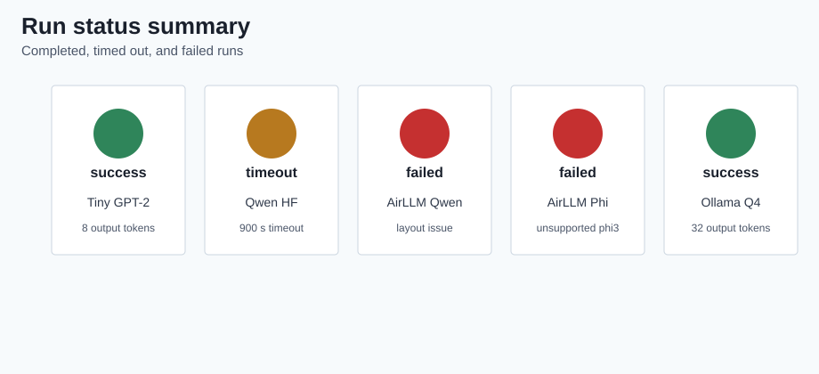
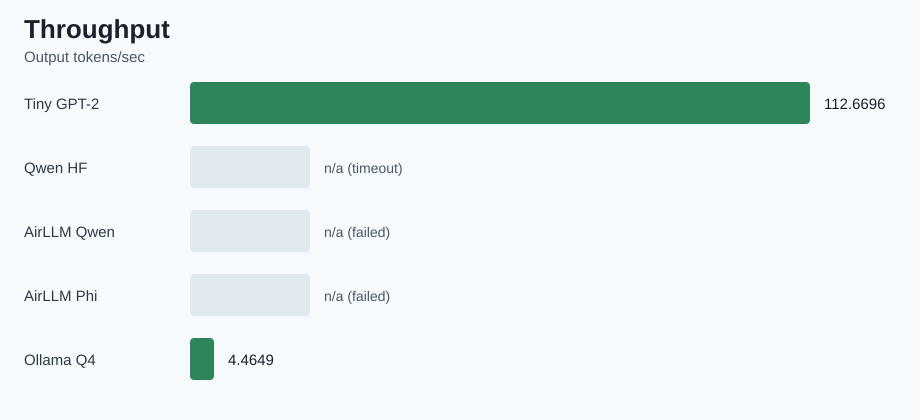
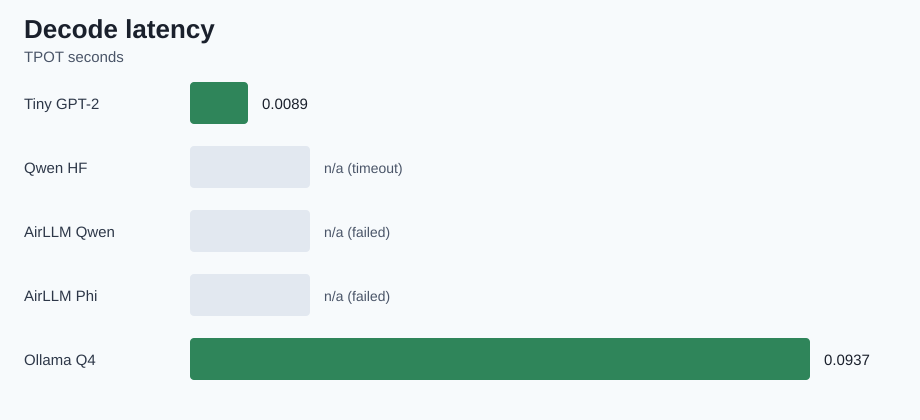
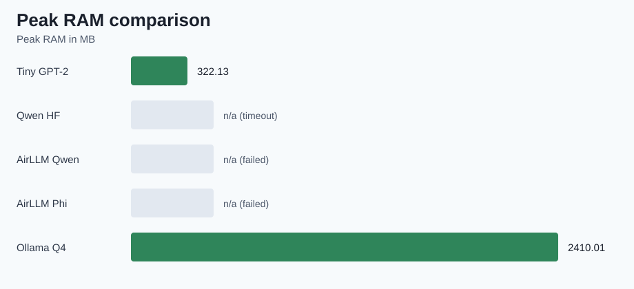

# AirLLM Local Inference Benchmark

This repository is the submission project for Exercise 05: running a large language model locally with AirLLM, quantization, and performance benchmarking.

The goal is to document a complete local/on-prem LLM experiment: hardware limits, baseline behavior, AirLLM behavior, performance metrics, and economic comparison against external API usage.

## Current Status

- Documentation scaffold exists under `docs/`.
- Project directories exist for source code, experiments, config, results, and figures.
- Hardware collection is implemented as the first reproducible experiment.
- Main assignment model is `Qwen/Qwen2.5-3B-Instruct`.
- Direct Transformers baseline timed out after 900 seconds.
- AirLLM is installed and has been tested against the selected model and backup
  model.
- Quantized GGUF inference through Ollama succeeded with Qwen 2.5 3B Q4_K_M.

## Repository Structure

```text
.
|-- config/
|   `-- experiment.example.json
|-- docs/
|   |-- AIRLLM_PLAN.md
|   |-- AIRLLM_RESULTS.md
|   |-- BASELINE_RESULTS.md
|   |-- BACKEND_COMPATIBILITY.md
|   |-- GGUF_RESULTS.md
|   |-- GGUF_QUANTIZATION_PLAN.md
|   |-- MEMORY_ESTIMATES.md
|   |-- MODEL_SELECTION.md
|   |-- PLAN.md
|   |-- PRD.md
|   |-- PRD_benchmarking.md
|   |-- RESULT_SUMMARY.md
|   `-- TODO.md
|-- experiments/
|   |-- collect_hardware.py
|   |-- check_backends.py
|   |-- run_airllm.py
|   |-- run_baseline.py
|   |-- run_ollama.py
|   `-- summarize_results.py
|-- figures/
|-- materials/
|-- results/
|-- src/
|   `-- airllm_benchmark/
|       |-- __init__.py
|       |-- hardware.py
|       |-- metrics.py
|       `-- runners/
|           |-- __init__.py
|           |-- airllm.py
|           |-- baseline.py
|           `-- ollama.py
|-- pyproject.toml
`-- README.md
```

## Setup

This project uses `uv`.

```powershell
uv run python experiments/collect_hardware.py
```

The command writes hardware information to:

```text
results/hardware.json
```

## Tiny Baseline Smoke Test

The tiny baseline smoke test validates the benchmark pipeline with
`sshleifer/tiny-gpt2`. This is only a plumbing check for Transformers loading,
generation, timing, memory sampling, and JSON output. It is not the final model
for the assignment.

```powershell
uv run python experiments/run_baseline.py
```

The command writes the smoke-test benchmark result to:

```text
results/baseline_tiny_gpt2.json
```

## Planned Model Strategy

| Role | Model |
| --- | --- |
| Completed pipeline validation | `sshleifer/tiny-gpt2` |
| Main HF/AirLLM candidate | `Qwen/Qwen2.5-3B-Instruct` |
| Optional quantized GGUF comparison | `Qwen/Qwen2.5-3B-Instruct-GGUF:Q4_K_M` |
| Backup HF candidate | `microsoft/Phi-3-mini-4k-instruct` |
| Deferred as too large for first download | `Qwen/Qwen2.5-7B-Instruct` |

The selected 3B Qwen model is intended to stress the 15.8 GB RAM laptop without
making the first real experiment as risky as a full 7B BF16 direct load.

## Current Baseline Result

The direct Transformers baseline for `Qwen/Qwen2.5-3B-Instruct` timed out after
900 seconds with the fixed prompt and a 32-token generation limit. The raw result
is stored in:

```text
results/baseline_qwen_qwen2_5_3b_instruct.json
```

This is a valid negative baseline outcome: direct BF16 Transformers execution is
not comfortable on the current CPU/RAM-only laptop setup.

## Planned AirLLM Experiment

The next planned intervention is AirLLM with the same
`Qwen/Qwen2.5-3B-Instruct` model, prompt, and generation settings. The planned
layer/cache path is:

```text
airllm_cache/qwen2_5_3b_instruct
```

AirLLM has been installed and verified through the project `uv` environment.
The exact `airllm.__version__` attribute check fails because the package does
not expose that attribute, but package metadata reports `airllm==2.11.0`. The
install check is stored in `results/airllm_install_check.json`, and the detailed
plan is documented in `docs/AIRLLM_PLAN.md`.

The first AirLLM execution attempt failed before benchmarking because Hugging
Face cache symlink creation hit Windows privilege error `WinError 1314`. The raw
result is stored in `results/airllm_qwen_qwen2_5_3b_instruct.json` and
documented in `docs/AIRLLM_RESULTS.md`.

A retry using a project-local Hugging Face cache bypassed the symlink failure
and progressed through AirLLM layer sharding, but failed before generation with
`IndexError: list index out of range`. The current raw AirLLM result is stored in
`results/airllm_qwen_qwen2_5_3b_instruct.json`.

The documented backup model, `microsoft/Phi-3-mini-4k-instruct`, was also tried
with AirLLM. Sharding completed, but generation failed because Optimum
BetterTransformer does not support model type `phi3`. The raw result is stored
in `results/airllm_phi3_mini_instruct.json`.

## GGUF Quantization Result

The quantized GGUF comparison uses:

```text
hf.co/Qwen/Qwen2.5-3B-Instruct-GGUF:Q4_K_M
```

Ollama `0.30.8` was installed, the 2.1 GB Q4_K_M model was downloaded, and the
same fixed prompt completed successfully through the local Ollama API. The raw
result is stored in:

```text
results/gguf_qwen2_5_3b_instruct_q4_k_m.json
```

Key result: 32 output tokens, 10.6684 tokens/second, 3.4027 seconds total
runtime, and 2410.01 MB peak RAM across the Ollama runtime processes. The
details are documented in `docs/GGUF_RESULTS.md`.

## Result Summary

The cross-run summary table is generated from the saved JSON files only:

```powershell
uv run python experiments/summarize_results.py
```

| Run | Backend | Model | Quantization | Status | Runtime (s) | Tokens/s | Peak RAM (MB) | Evidence |
| --- | --- | --- | --- | --- | ---: | ---: | ---: | --- |
| Tiny Transformers smoke test | transformers | `sshleifer/tiny-gpt2` | n/a | success | 2.8321 | 112.6696 | 322.13 | Completed 8 output tokens |
| Direct Qwen Transformers | transformers | `Qwen/Qwen2.5-3B-Instruct` | n/a | timeout | 900 | n/a | n/a | Timed out after 900 seconds |
| AirLLM Qwen | airllm | `Qwen/Qwen2.5-3B-Instruct` | n/a | failed | n/a | n/a | n/a | `IndexError: list index out of range` |
| AirLLM Phi-3 backup | airllm | `microsoft/Phi-3-mini-4k-instruct` | n/a | failed | n/a | n/a | n/a | BetterTransformer does not support `phi3` |
| Ollama GGUF Q4 | ollama | `hf.co/Qwen/Qwen2.5-3B-Instruct-GGUF:Q4_K_M` | Q4_K_M | success | 3.4027 | 10.6684 | 2410.01 | Completed 32 output tokens |

The same table and interpretation are kept in `docs/RESULT_SUMMARY.md`.

## Figures

The comparison figures are generated from saved result JSON files only:

```powershell
uv run python experiments/make_figures.py
```









## Qualitative Comparison

| Run | Output quality / behavior | Report use |
| --- | --- | --- |
| Tiny Transformers smoke test | Completed quickly, but repeated `stairs`; useful only as a plumbing check. | Validates benchmark code, not model capability. |
| Direct Qwen Transformers | Produced no completed output because the worker timed out after 900 seconds. | Negative full-precision baseline. |
| AirLLM Qwen | Produced no generation; failed after partial sharding with `IndexError`. | AirLLM/model-layout compatibility evidence. |
| AirLLM Phi-3 backup | Produced no generation; failed because BetterTransformer does not support `phi3`. | Backup-model dependency compatibility evidence. |
| Ollama GGUF Q4 | Produced a relevant explanation beginning with the requested prefill/decode topic. | Best successful local inference result. |

## Analysis

The experiment separates pipeline validation from local deployment feasibility.
The tiny GPT-2 run completed quickly and confirms that the benchmark harness,
timing fields, memory sampling, and JSON output are working. It should not be
used as evidence that the target workload is easy, because it is far smaller
than the selected assignment model.

The direct Transformers Qwen 3B baseline is the important negative baseline. It
timed out after 900 seconds on this Windows 11 laptop with an Intel i7-10510U,
15.8 GB RAM, and integrated Intel UHD graphics. That result shows that a
straight BF16 Hugging Face path is not a practical local inference mode here,
even though the model has only 3B parameters.

The AirLLM attempts are also useful evidence. Qwen 3B first exposed a
Windows/Hugging Face cache symlink privilege issue; after switching to a
project-local cache and disabling symlink use, AirLLM progressed through partial
sharding but failed with a model-layout `IndexError`. The Phi-3 backup model
then reached a different limitation: BetterTransformer does not support model
type `phi3` in this stack. These failures support the deployment conclusion that
local LLM success depends on the exact combination of model architecture, file
format, backend implementation, dependency version, operating-system behavior,
and memory strategy.

The successful Ollama GGUF Q4 run is the strongest result. It used the same
fixed prompt and 32-token generation target, completed in 3.4027 seconds, and
produced 10.6684 output tokens per second with about 2.4 GB peak RAM. On this
hardware, quantization and a runtime designed for GGUF had a larger practical
impact than attempting direct full-precision Transformers execution or the
tested AirLLM model combinations.

## Remaining Report Work

- Hardware specification.
- Model selection and justification.
- Direct baseline analysis.
- AirLLM and quantization analysis.
- Performance comparison from `docs/RESULT_SUMMARY.md`.
- Economic comparison: on-prem versus API.
- Lecture concept analysis: Prefill, Decode, VRAM, paging, and memory-bound behavior.
- Original extension and conclusions.
