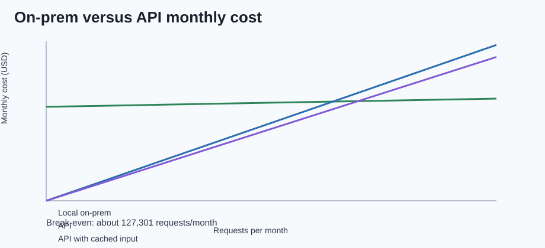

# AirLLM Local Inference Benchmark

This repository is the submission project for Exercise 05: running a large language model locally with AirLLM, quantization, and performance benchmarking.

The goal is to document a complete local/on-prem LLM experiment: hardware limits, baseline behavior, AirLLM behavior, performance metrics, and economic comparison against external API usage.

## Current Status

- Documentation scaffold exists under `docs/`.
- Project directories exist for source code, experiments, config, results, and figures.
- Hardware collection is implemented as the first reproducible experiment.
- Main assignment model is `Qwen/Qwen2.5-3B-Instruct`.
- Direct Transformers baseline timed out after 900 seconds.
- AirLLM is installed and has been tested against the selected model and backup
  model.
- Quantized GGUF inference through Ollama succeeded with Qwen 2.5 3B Q4_K_M.

## Repository Structure

```text
.
|-- config/
|   `-- experiment.example.json
|-- docs/
|   |-- AIRLLM_PLAN.md
|   |-- AIRLLM_RESULTS.md
|   |-- BASELINE_RESULTS.md
|   |-- BACKEND_COMPATIBILITY.md
|   |-- ECONOMIC_ANALYSIS.md
|   |-- GGUF_RESULTS.md
|   |-- GGUF_QUANTIZATION_PLAN.md
|   |-- MEMORY_ESTIMATES.md
|   |-- MODEL_SELECTION.md
|   |-- PLAN.md
|   |-- PRD.md
|   |-- PRD_benchmarking.md
|   |-- RESULT_SUMMARY.md
|   `-- TODO.md
|-- experiments/
|   |-- collect_hardware.py
|   |-- check_backends.py
|   |-- make_figures.py
|   |-- run_economics.py
|   |-- run_airllm.py
|   |-- run_baseline.py
|   |-- run_ollama.py
|   `-- summarize_results.py
|-- figures/
|   |-- decode_latency_comparison.svg
|   |-- cost_break_even.svg
|   |-- memory_comparison.svg
|   |-- run_status_summary.svg
|   `-- throughput_comparison.svg
|-- materials/
|-- results/
|-- src/
|   `-- airllm_benchmark/
|       |-- __init__.py
|       |-- hardware.py
|       |-- metrics.py
|       `-- runners/
|           |-- __init__.py
|           |-- airllm.py
|           |-- baseline.py
|           `-- ollama.py
|-- pyproject.toml
`-- uv.lock
```

## Setup

This project uses `uv`.

```powershell
uv run python experiments/collect_hardware.py
```

The command writes hardware information to:

```text
results/hardware.json
```

## Hardware Specification

The experiment was run on a Windows 11 laptop, recorded in
`results/hardware.json`.

| Component | Value |
| --- | --- |
| CPU | Intel(R) Core(TM) i7-10510U CPU @ 1.80GHz |
| CPU cores | 4 physical, 8 logical |
| RAM | 15.8 GB |
| GPU | Intel(R) UHD Graphics |
| Reported VRAM | 1.0 GB |
| Disk | 471.82 GB total, 315.97 GB free at collection time |
| Python | CPython 3.12.13 in the project `.venv` |

This is a CPU/RAM-limited inference environment. The integrated Intel GPU is not
a practical CUDA target, so the central bottleneck is system memory, memory
bandwidth, and backend compatibility rather than GPU throughput.

## Tiny Baseline Smoke Test

The tiny baseline smoke test validates the benchmark pipeline with
`sshleifer/tiny-gpt2`. This is only a plumbing check for Transformers loading,
generation, timing, memory sampling, and JSON output. It is not the final model
for the assignment.

```powershell
uv run python experiments/run_baseline.py
```

The command writes the smoke-test benchmark result to:

```text
results/baseline_tiny_gpt2.json
```

## Model Strategy

| Role | Model |
| --- | --- |
| Completed pipeline validation | `sshleifer/tiny-gpt2` |
| Main HF/AirLLM candidate | `Qwen/Qwen2.5-3B-Instruct` |
| Quantized GGUF comparison | `Qwen/Qwen2.5-3B-Instruct-GGUF:Q4_K_M` |
| Backup HF candidate | `microsoft/Phi-3-mini-4k-instruct` |
| Deferred as too large for first download | `Qwen/Qwen2.5-7B-Instruct` |

The selected 3B Qwen model is intended to stress the 15.8 GB RAM laptop without
making the first real experiment as risky as a full 7B BF16 direct load.

The model choice deliberately avoids two extremes. `sshleifer/tiny-gpt2` is too
small to prove local LLM feasibility, so it is used only to validate the
benchmark plumbing. A 7B BF16 model is too close to the laptop's total RAM before
runtime overhead, KV cache, tokenizer buffers, and the operating system are
counted. Qwen 2.5 3B is the middle point: large enough to expose practical local
deployment limits, but still plausible for an AirLLM and quantized GGUF
experiment. The matching Q4_K_M GGUF model keeps the quantized comparison in the
same model family.

## Current Baseline Result

The direct Transformers baseline for `Qwen/Qwen2.5-3B-Instruct` timed out after
900 seconds with the fixed prompt and a 32-token generation limit. The raw result
is stored in:

```text
results/baseline_qwen_qwen2_5_3b_instruct.json
```

This is a valid negative baseline outcome: direct BF16 Transformers execution is
not comfortable on the current CPU/RAM-only laptop setup.

## AirLLM Experiment Results

The AirLLM intervention used the same
`Qwen/Qwen2.5-3B-Instruct` model, prompt, and generation settings. The planned
layer/cache path is:

```text
airllm_cache/qwen2_5_3b_instruct
```

AirLLM has been installed and verified through the project `uv` environment.
The exact `airllm.__version__` attribute check fails because the package does
not expose that attribute, but package metadata reports `airllm==2.11.0`. The
install check is stored in `results/airllm_install_check.json`, and the detailed
plan is documented in `docs/AIRLLM_PLAN.md`.

The first AirLLM execution attempt failed before benchmarking because Hugging
Face cache symlink creation hit Windows privilege error `WinError 1314`. The raw
result is stored in `results/airllm_qwen_qwen2_5_3b_instruct.json` and
documented in `docs/AIRLLM_RESULTS.md`.

A retry using a project-local Hugging Face cache bypassed the symlink failure
and progressed through AirLLM layer sharding, but failed before generation with
`IndexError: list index out of range`. The current raw AirLLM result is stored in
`results/airllm_qwen_qwen2_5_3b_instruct.json`.

The documented backup model, `microsoft/Phi-3-mini-4k-instruct`, was also tried
with AirLLM. Sharding completed, but generation failed because Optimum
BetterTransformer does not support model type `phi3`. The raw result is stored
in `results/airllm_phi3_mini_instruct.json`.

## GGUF Quantization Result

The quantized GGUF comparison uses:

```text
hf.co/Qwen/Qwen2.5-3B-Instruct-GGUF:Q4_K_M
```

Ollama `0.30.8` was installed, the 2.1 GB Q4_K_M model was downloaded, and the
same fixed prompt completed successfully through the local Ollama API. The raw
result is stored in:

```text
results/gguf_qwen2_5_3b_instruct_q4_k_m.json
```

Key result: 32 output tokens, 10.6684 tokens/second, 3.4027 seconds total
runtime, and 2410.01 MB peak RAM across the Ollama runtime processes. The
details are documented in `docs/GGUF_RESULTS.md`.

## Result Summary

The cross-run summary table is generated from the saved JSON files only:

```powershell
uv run python experiments/summarize_results.py
```

| Run | Backend | Model | Quantization | Status | Runtime (s) | Tokens/s | Peak RAM (MB) | Evidence |
| --- | --- | --- | --- | --- | ---: | ---: | ---: | --- |
| Tiny Transformers smoke test | transformers | `sshleifer/tiny-gpt2` | n/a | success | 2.8321 | 112.6696 | 322.13 | Completed 8 output tokens |
| Direct Qwen Transformers | transformers | `Qwen/Qwen2.5-3B-Instruct` | n/a | timeout | 900 | n/a | n/a | Timed out after 900 seconds |
| AirLLM Qwen | airllm | `Qwen/Qwen2.5-3B-Instruct` | n/a | failed | n/a | n/a | n/a | `IndexError: list index out of range` |
| AirLLM Phi-3 backup | airllm | `microsoft/Phi-3-mini-4k-instruct` | n/a | failed | n/a | n/a | n/a | BetterTransformer does not support `phi3` |
| Ollama GGUF Q4 | ollama | `hf.co/Qwen/Qwen2.5-3B-Instruct-GGUF:Q4_K_M` | Q4_K_M | success | 3.4027 | 10.6684 | 2410.01 | Completed 32 output tokens |

The same table and interpretation are kept in `docs/RESULT_SUMMARY.md`.

## Figures

The comparison figures are generated from saved result JSON files only:

```powershell
uv run python experiments/make_figures.py
```


## Qualitative Comparison

| Run | Output quality / behavior | Report use |
| --- | --- | --- |
| Tiny Transformers smoke test | Completed quickly, but repeated `stairs`; useful only as a plumbing check. | Validates benchmark code, not model capability. |
| Direct Qwen Transformers | Produced no completed output because the worker timed out after 900 seconds. | Negative full-precision baseline. |
| AirLLM Qwen | Produced no generation; failed after partial sharding with `IndexError`. | AirLLM/model-layout compatibility evidence. |
| AirLLM Phi-3 backup | Produced no generation; failed because BetterTransformer does not support `phi3`. | Backup-model dependency compatibility evidence. |
| Ollama GGUF Q4 | Produced a relevant explanation beginning with the requested prefill/decode topic. | Best successful local inference result. |

## Economic Analysis

The cost comparison is generated from explicit assumptions in
`experiments/run_economics.py`:

```powershell
uv run python experiments/run_economics.py
```

The API reference point is OpenAI `GPT-5.4 mini` standard pricing, accessed on
2026-06-20: $0.75 per 1M input tokens, $0.075 per 1M cached input tokens, and
$4.50 per 1M output tokens, based on the official OpenAI API pricing page:
<https://openai.com/api/pricing/>. This is an illustrative external-service
comparison point, not a claim that the API model is quality-equivalent to the
local Qwen GGUF model. The local assumptions are a $700 laptop amortized over 36
months, $0.20/kWh electricity, and a 45 W estimated inference power draw.

For the measured GGUF workload of 23 input tokens and 32 output tokens, the API
request cost is about $0.000161. The local variable electricity cost is about
$0.0000085 per request, but the amortized hardware cost is about $19.44 per
month. Under these assumptions, local inference breaks even at about 127,000
similar requests per month. With 80% cached input tokens, the API request cost
falls slightly and break-even moves to about 139,000 requests per month.



## Analysis

The experiment separates pipeline validation from local deployment feasibility.
The tiny GPT-2 run completed quickly and confirms that the benchmark harness,
timing fields, memory sampling, and JSON output are working. It should not be
used as evidence that the target workload is easy, because it is far smaller
than the selected assignment model.

The direct Transformers Qwen 3B baseline is the important negative baseline. It
timed out after 900 seconds on this Windows 11 laptop with an Intel i7-10510U,
15.8 GB RAM, and integrated Intel UHD graphics. That result shows that a
straight BF16 Hugging Face path is not a practical local inference mode here,
even though the model has only 3B parameters.

The AirLLM attempts are also useful evidence. Qwen 3B first exposed a
Windows/Hugging Face cache symlink privilege issue; after switching to a
project-local cache and disabling symlink use, AirLLM progressed through partial
sharding but failed with a model-layout `IndexError`. The Phi-3 backup model
then reached a different limitation: BetterTransformer does not support model
type `phi3` in this stack. These failures support the deployment conclusion that
local LLM success depends on the exact combination of model architecture, file
format, backend implementation, dependency version, operating-system behavior,
and memory strategy.

The successful Ollama GGUF Q4 run is the strongest result. It used the same
fixed prompt and 32-token generation target, completed in 3.4027 seconds, and
produced 10.6684 output tokens per second with about 2.4 GB peak RAM. On this
hardware, quantization and a runtime designed for GGUF had a larger practical
impact than attempting direct full-precision Transformers execution or the
tested AirLLM model combinations.

## Lecture Concept Analysis

### Prefill And Decode

LLM inference has two major phases. In prefill, the model processes the whole
input prompt and builds the initial KV cache. This phase can use larger matrix
operations and is often more compute-bound on hardware that has a capable GPU.
In decode, the model generates one token at a time. Each new token depends on
the previous token, so this phase is more sequential and repeatedly touches
model weights and KV cache.

The successful Ollama result used a non-streaming local API call, so
`ttft_seconds` is recorded as `null`; the API response did not expose first-token
timing. The available decode-related metric is `tpot_seconds = 0.0937`, or about
10.6684 output tokens per second. The direct Transformers and AirLLM runs did
not complete generation, so their missing TTFT/TPOT fields are part of the
evidence: those paths failed before producing a normal inference trace.

### Compute-Bound Versus Memory-Bound

This laptop does not have a CUDA-capable GPU with enough VRAM for normal local
LLM serving. Direct BF16 Transformers therefore runs on a CPU/RAM path, where
large model weights, Python framework overhead, and memory movement dominate.
The 900-second Qwen timeout shows that the direct full-precision path is not
comfortable on this machine, even for a 3B-class model.

The GGUF result points in the other direction: the Q4_K_M model is about 2.1 GB
locally and completed with about 2.4 GB peak RAM across the Ollama runtime
processes. This suggests the practical bottleneck was not only parameter count;
format, quantization, and backend implementation changed whether the workload
was feasible.

### VRAM, Paging, And AirLLM

VRAM matters because transformer inference is usually fastest when weights,
activations, and KV cache fit near the GPU compute units. This machine reports
only 1.0 GB of integrated GPU VRAM, so the experiment is effectively a CPU and
system-RAM deployment.

AirLLM is relevant because it tries to reduce peak active memory by moving
through model layers rather than keeping the whole model resident in the same
way as a direct load. Conceptually, this resembles virtual memory and paging:
only the currently needed part of a larger working set is active, while other
parts live on disk or in a cache path. The tradeoff is latency. Moving layers
through memory and storage can make a model fit more easily, but repeated I/O
can slow generation substantially.

In this project, AirLLM did not reach completed generation. That is still useful
deployment evidence. The Qwen run first exposed a Windows/Hugging Face symlink
permission problem, then failed with a Qwen layout `IndexError` after the local
cache workaround. The Phi-3 backup completed sharding but failed because
BetterTransformer does not support `phi3`. These outcomes connect directly to
the lecture point that local LLM deployment depends on model architecture,
format, backend support, OS behavior, memory layout, and paging strategy.

### Quantization

Quantization reduces the number of bits used to store model weights. The direct
Qwen candidate uses Hugging Face SafeTensors/BF16, while the successful local run
uses Q4_K_M GGUF through Ollama. On this hardware, that change was decisive:
the BF16 Transformers path timed out, while the Q4 GGUF path completed the fixed
prompt in a few seconds. The cost is that quantization can reduce output quality
or model fidelity, but for this short technical prompt the Q4 output was usable.

## Limitations

- Only one successful full local inference path was measured: Qwen 2.5 3B
  Q4_K_M through Ollama.
- The successful Ollama call was non-streaming, so TTFT could not be measured.
- The direct Transformers and AirLLM runs produced valid failure evidence, but
  not complete latency/throughput curves.
- AirLLM was tested through the installed package stack rather than patched
  internally for Qwen or Phi-3 compatibility.
- Power draw is an estimate, not a direct wattmeter measurement.
- API pricing changes over time, so the economic analysis records the pricing
  date and should be refreshed for future use.

## Recommendation

For this laptop, the recommended local path is quantized GGUF through Ollama or
a similar GGUF runtime. Direct BF16 Transformers is not practical for Qwen 2.5
3B on this CPU/RAM-only setup, and the tested AirLLM combinations were blocked
by backend/model compatibility before generation.

Use local inference when privacy, offline operation, reproducibility,
experimentation, or high repeated request volume matter. Use an external API
when quality, low setup effort, bursty usage, or operational reliability matter
more than keeping inference fully on-prem. Under the assumptions in this report,
local inference becomes economically attractive only at high volume: roughly
127,000 similar requests per month for the measured workload.

## Final Conclusion

The main finding is that local LLM feasibility is not determined by parameter
count alone. On modest hardware, model format, quantization, backend support,
operating-system behavior, cache layout, and memory movement dominate the
outcome. Tiny GPT-2 proved the benchmark pipeline, direct Qwen Transformers
proved the negative full-precision baseline, AirLLM exposed real local
deployment compatibility issues, and Ollama GGUF Q4 provided the successful
on-prem inference path.

## Remaining Work

- Final verification and submission checklist.
